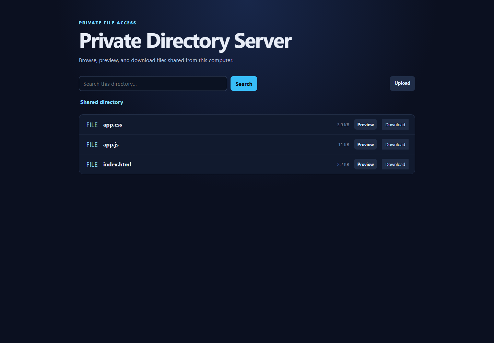

# Private Directory Server

[](https://github.com/Justichuu/private-directory-server/actions/workflows/ci.yml)
[](LICENSE)

A free, open-source, dependency-free runtime for browsing files from your own computer. It provides token authentication, recursive search, mobile-friendly previews, resumable media streaming, and optional non-overwriting uploads while keeping localhost-only, read-only behavior as the default.

This is openly a vibe-coded project: it is being shaped through human direction, testing, and judgment in collaboration with multiple AI development tools. That process does not replace verification. Security-sensitive behavior is documented, tested, and reviewed against the running application before release.



## The easy way

**Windows, no terminal at all:**

1. [Download the latest release](https://github.com/Justichuu/private-directory-server/releases/latest) or `git clone` this repo.
2. Double-click `gui\build.cmd` once. It compiles a small desktop app using tools already built into Windows — nothing extra to install.
3. Double-click the new `Private Directory Server.exe`. The first time, a small window tells you where to find it: **Windows hides new tray icons by default** — click the `^` arrow near the clock to reveal it. Right-click the icon and choose **Start Server**; it asks you to browse to and pick a folder, then serves it. Right-click again to stop, reopen it in your browser, change the folder, or quit.

To open it on your phone, right-click the tray icon and choose **Show Phone Address / QR Code...**. The first time, it asks to turn on network access — this switches the server from PC-only to reachable by other devices on your Wi-Fi, protected by an automatically-generated access code. It then shows a QR code: scan it with your phone's camera, or copy the address and access code shown and enter them manually. Your phone must be on the same Wi-Fi network as this PC.

**Everyone else, three commands, forever:**

```powershell
npm start      # start the server (installs and builds automatically on first run)
npm test       # run the test suite
npm run menu   # do anything else: build, package, type-check
```

Prefer double-clicking to typing? Use `start.cmd` / `test.cmd` / `menu.cmd` (Windows) or `start.sh` / `test.sh` / `menu.sh` (macOS/Linux) — same three things, no terminal required to launch them.

The full command reference below still works exactly as documented; none of this replaces it.

## Why use it?

- Secure defaults: localhost binding, read-only access, hidden files excluded, and no symlink escape.
- Private-network ready: non-loopback binding requires a strong access token.
- Useful on phones: responsive browsing, search, image/text/PDF/audio/video previews, and downloads.
- Large-file friendly: real single-range HTTP streaming supports media seeking and resumed downloads.
- Deliberately small: Node.js is the only runtime dependency.
- Tested: strict TypeScript plus HTTP integration tests on Windows and Linux.

## Project principles

- Free software: the MIT license permits personal, educational, and commercial use.
- Honest authorship: human and AI-assisted contributions are both welcome when their behavior is understood and verified.
- Secure defaults: convenience features must not silently broaden network or write access.
- Evidence over claims: compilation is not completion; tests, packaging, and real runtime surfaces must pass.
- No telemetry: the server makes no analytics or tracking requests.

## Quick start from source

Requires Node.js 22 or newer.

```powershell
git clone https://github.com/Justichuu/private-directory-server.git
Set-Location private-directory-server
cmd /c npm ci
$env:DIRECTORY_ROOT = 'D:\Path\To\Share'
cmd /c npm start
```

Open `http://127.0.0.1:8000`.

## Run a release download

Download and extract the `.zip` or `.tar.gz` from GitHub Releases, then set `DIRECTORY_ROOT` and run `start.cmd` on Windows or `./start.sh` on Linux/macOS. Release bundles contain compiled JavaScript and need no package installation.

Windows users who want the tray app without building anything can instead download `private-directory-server-windows-gui-<version>.zip` — it's the same release bundle with `Private Directory Server.exe` already built in. Extract it and double-click the exe.

## Private-network access

Create a strong token and bind to the network:

```powershell
$env:ACCESS_TOKEN = [Convert]::ToHexString([Security.Cryptography.RandomNumberGenerator]::GetBytes(24)).ToLower()
$env:HOST = '0.0.0.0'
$env:DIRECTORY_ROOT = 'D:\Path\To\Share'
cmd /c npm start
```

Enter that token in the browser login screen. The browser stores only an opaque HTTP-only session cookie; it does not save the token in local storage. This server does not provide TLS. Use it on a trusted network or behind a trusted private HTTPS reverse proxy.

## Docker

```powershell
docker build -t private-directory-server .
docker run --rm -p 8000:8000 `
  -e ACCESS_TOKEN='replace-with-a-strong-token' `
  -v 'D:\Path\To\Share:/shared:ro' `
  private-directory-server
```

Open `http://127.0.0.1:8000`. Keep the volume read-only unless optional uploads are intentionally enabled.

## Configuration

| Variable | Default | Purpose |
| --- | --- | --- |
| `DIRECTORY_ROOT` | Current directory | Directory available through the server |
| `HOST` | `127.0.0.1` | Listening interface; non-loopback values require `ACCESS_TOKEN` |
| `PORT` | `8000` | TCP port; `0` selects a free ephemeral port |
| `ACCESS_TOKEN` | unset | Token of at least 16 characters used for browser and bearer authentication |
| `ACCESS_MODE` | `read-only` | Set to `upload` for bounded, non-overwriting uploads |
| `MAX_UPLOAD_BYTES` | `104857600` | Maximum upload body size in bytes |
| `SHOW_HIDDEN` | `false` | Include dotfiles and dot-directories when `true` |
| `LOG_REQUESTS` | `false` | Log client address, method, path, status, and duration when `true` |

Bearer clients can send `Authorization: Bearer <token>`. Access tokens are never accepted in URLs or written to request logs.

## Security model

- Traversal and malformed URL paths are rejected.
- Real paths are checked so symlinks cannot escape `DIRECTORY_ROOT`.
- Hidden path segments are blocked unless explicitly enabled.
- Uploads are disabled by default, size-limited, and cannot overwrite an existing file.
- Browser sessions use `HttpOnly` and `SameSite=Strict` cookies.
- Security headers restrict framing to same-origin previews, block cross-origin resource use, and prevent unexpected content sniffing.
- The unauthenticated health endpoint exposes only `{ "status": "ready" }`.

See [SECURITY.md](SECURITY.md) before exposing the service beyond localhost.

## Development

```powershell
cmd /c npm run check
cmd /c npm test
cmd /c npm run package
```

Each of these (and `npm start`) installs dependencies automatically on first run — a fresh `git clone` needs no separate `npm ci` step. `npm run menu` wraps all of them plus the server itself in one interactive, numbered prompt.

`npm run package` creates a dependency-free runtime directory under `release/`. Pull requests run strict checks, integration tests, and packaging on Windows and Linux. Tags matching `v*` produce `.zip` and `.tar.gz` GitHub release assets, plus a Windows build that includes the desktop tray launcher (`gui/Launcher.cs`, compiled with the `csc.exe` that ships with .NET Framework — no npm dependency added). Run `gui\build.cmd` to build that launcher locally instead of waiting for a release.

## HTTP API

| Method | Route | Purpose |
| --- | --- | --- |
| `GET` | `/api/health` | Minimal readiness response |
| `GET`, `POST`, `DELETE` | `/api/session` | Session state, login, and logout |
| `GET` | `/api/files?path=<directory>` | Directory listing |
| `POST` | `/api/files?path=<new-file>` | Optional raw-body upload |
| `GET` | `/api/search?path=<directory>&q=<query>` | Recursive name search, capped at 200 results |
| `GET`, `HEAD` | `/view/<file>` | Inline preview with byte-range support |
| `GET`, `HEAD` | `/files/<file>` | Download with byte-range support |

## Contributing

Read [CONTRIBUTING.md](CONTRIBUTING.md) before opening a pull request. Please report security issues privately as described in [SECURITY.md](SECURITY.md).

## Documentation

- [Architecture](docs/ARCHITECTURE.md) — components, request flow, and trust boundaries
- [Configuration](docs/CONFIGURATION.md) — every environment variable and deployment example
- [Development and releases](docs/DEVELOPMENT.md) — build, test, packaging, CI, and release process
- [AI-assisted collaboration](docs/AI_COLLABORATION.md) — provenance and review expectations
- [Security model](docs/SECURITY_MODEL.md) — protected assets, controls, and known limits
- [Changelog](CHANGELOG.md) — user-visible release history
- [Acknowledgments](ACKNOWLEDGMENTS.md) — project authorship and collaborative process
